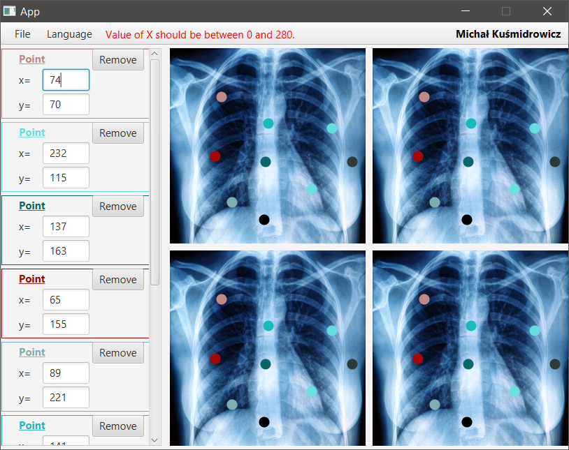

# PROJECT: ROENTGEN

A simple application made in JavaFX as a recruitment task.

## Control on image panels

* **Left mouse button click** - Creating a new circle instance at the click position.
* **Left mouse button press and drag** - Moving the particualr circle to a new position.
* **Right mouse button click** - Removing the particualr circle from the panel.

## Screenshots

<p align="center">


</p><br>

## Additional tasks

### Mentioned in the instruction

* Coordinates of points relative to the image
* Validation of text fields (the particular circle cannot overlap another one and its coordinates (x,y) have to be within [0,image panel size] range)

### Not mentioned in the instruction

* The user is able to change the picture presented in the grid panel via the upper panel: **File**>**Load picture**. By default, the exemplary image is loaded.
* One can clear all points via: **File**>**Reset points**.
* There are two language versions of the app - English and Polish one. Switching between them: **Language** at the upper panel.
* Cursor can takes the form of crossed arrows when the circle is being dragged and a hand with the index finger outstreched when it points at the specific circle.
* There is a scrollbar on the left panel containing circles' data panels.
* Circles have randomly generated colors.This also applies to the circles' data panels (**Point** label and the panels' outlines).
* The user is not able to place one circle on top of another. This is the case for both dragging the circle and modifying its coordinates via the panel. 

## Getting Started
These instructions will get you a copy of the project up and running on your local machine for development and testing purposes. 

### Prerequisites
In order to properly build application one might need to install [JDK 1.8](https://www.oracle.com/java/technologies/javase/javase-jdk8-downloads.html) and [Maven](https://maven.apache.org/download.cgi).

### Cloning
```
$ git clone https://github.com/ninjarlz/project_roentgen
```

### Building
One can build the project via Maven commands or in e.g. IDE like IntelliJ (in such case one has to install additional IntelliJ plugin for Lombok library).

## Built with
* [JavaFX](https://www.oracle.com/java/technologies/javase/javafx-overview.html) - a software platform for creating and delivering desktop applications

## Developers
* **Michał Kuśmidrowicz** - [ninjarlz](https://github.com/ninjarlz)

## License
This project is licensed under the MIT License - see the [LICENSE.md](LICENSE.md) file for details


